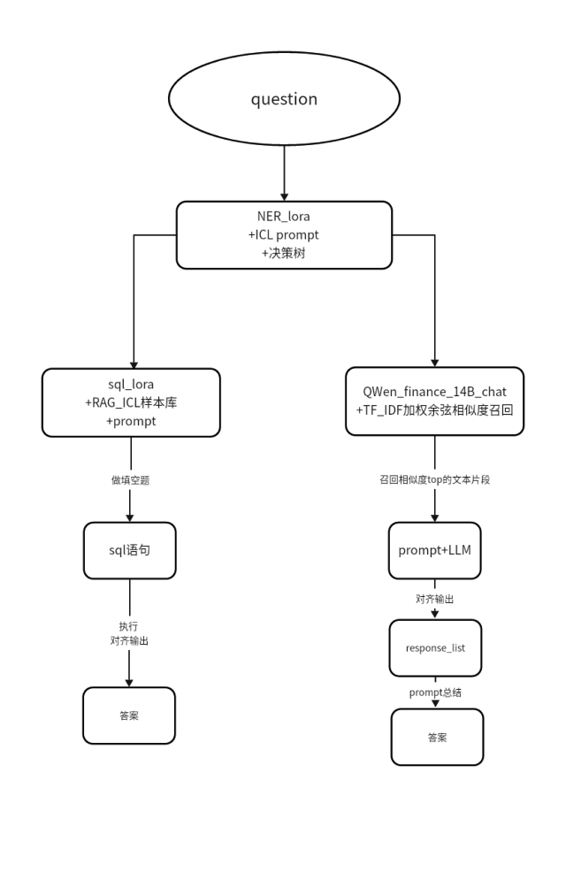

可以这样使用对话系统

```shell
cd llm/demo
python app.py
```


我们是在autodl.com这个平台上做的,想看前端并演示需要使用ssh链接到本地

以下是教程
开放端口：https://www.autodl.com/docs/port/
视频教程：https://www.bilibili.com/video/BV1oh4y1n7Nv/ 
个人用户没有公网端口，只能使用ssh隧道，详见视频教程www.bilibili.com/video/BV1Pk4y1w7Pk


可能在其他机器上情况有所不同,可能要修改app.py代码
但不影响conversation.py(无前端的)


并且模型位置改变,要修改路径


需要下载基础模型,微调的 LoRA 模型（ `sql_lora` 和 `NER_lora` 模型）不能脱离基础模型单独使用。这是因为这些微调模型只包含了一些特定的适配层或参数调整，而并没有包含完整的预训练模型的所有参数。它们依赖于基础模型来提供大部分的语言理解和生成能力


使用下面的代码下载,`cache_dir`设置为要下载到的路径

```python
from modelscope.hub.snapshot_download import snapshot_download

model_dir = snapshot_download('TongyiFinance/Tongyi-Finance-14B-Chat', cache_dir='/root/autodl-tmp')
```


**工作流图**

